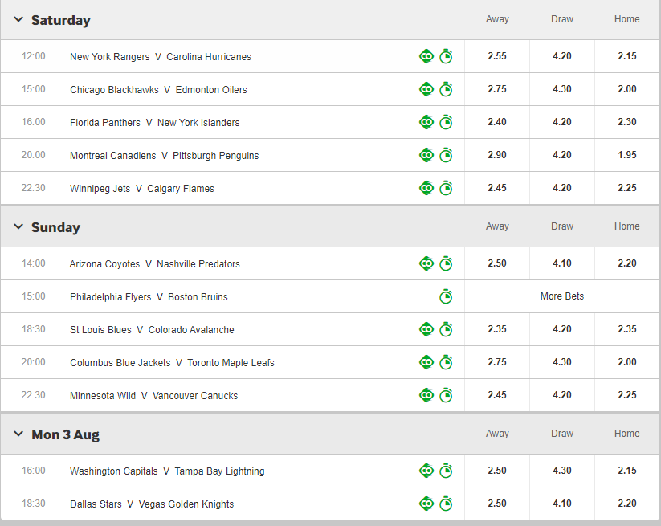

# nhl-predictor

A statistical model which can predict winners in NHL games. It is based on the (homogenous)Poisson distribution and utilizes data gathered from the 2019-2020 NHL season. 
It performs regression analysis to come up with relative team strengths, taking into account home-ice advantage, and feeds the results to a match simulator which
produces a probability matrix; from there the probabilities of the Home Team winning, Away Team winning, or an Overtime/Shootout 
result can be calculated using simple matrix operations.

Probability predictions for the 2020 NHL Playoffs generated by the model:

Linear Regression results showing Offensive/Defensive strength coefficients of each NHL Team:
(Take e^Coefficient to un-log the scale and obtain a coefficient which displays strength relative to average team, i.e e^0 = 1 = perfectly average)

Conclusion: 

This model is based off simple Poisson. This inherently is a drawback because goals scored in games are not always independent. For example, in a 1 goal game with 1 minute left, the chance of scoring is likely higher. Another consideration is the accuracy of statistics. I used datasets from https://www.hockey-reference.com/leagues/NHL_2020_games.html. But goals scored can be deceiving in that sometimes teams may have injuries or very good games where they score an abnormal number of goals, etc; this influences and skews results. Also, the model is a homogenous Poisson process, hence it assumes goals are scored uniformly throughout 3 periods, this is unlikely to be the case. Thus suggestions for improvement include utilizing non-homogenous Poisson processes, research suggests the Weibull distribution may be a good candidate.

The performance of this model can be compared to that of large betting sites. Below I will compare the odds suggested by the prominent betting site, Betway, to my model's odds.

This image shows current (7/27) Betway decimal odds for the 2020 playoff round robin. It proposes 2.45 4.20 2.25 Away/Draw/Home on the Minnesota at Canucks game on Sunday. This means for every $1 bet on Canucks winning, you will get $2.25. My program outputs probabilities, but that is no issue as we can easily convert between decimal odds, since it is just the inverse. Hence Betway, with 2.25 odds of a Canucks win (at home) is suggesting a 1/2.25 = 44.44% chance of Canucks win, 1/4.20 = 23.8% draw, and 40.8% Minnesota win. Compared to my model's prediction of 47% Canucks win, 15.3% draw, 35.5% Minnesota win. One last check is Betway suggests 51.2% Pittsburgh home win, compared to 53% by my model. I consider this comparable results (although we will see whether either models are effective after the playoffs!).

Requirements (Py modules): pandas, matplotlib, numpy, statsmodels, seaborn

To Run (Windows): 

py sports.py

