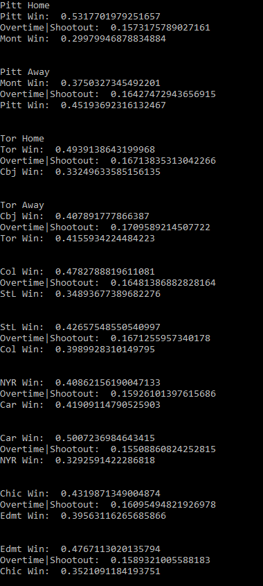
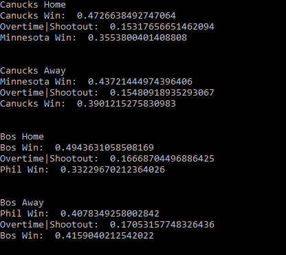
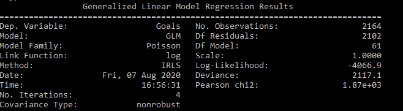
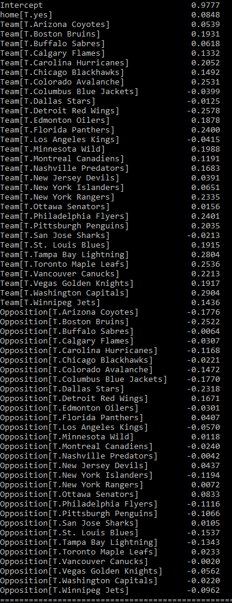

# nhl-predictor

A statistical model which can predict winners in NHL games. It is based on the (homogenous)Poisson distribution and utilizes data gathered from the 2019-2020 NHL season. 
It performs regression analysis to come up with relative team strengths, taking into account home-ice advantage, and feeds the results to a match simulator which
produces a probability matrix; from there the probabilities of the Home Team winning, Away Team winning, or an Overtime/Shootout 
result can be calculated using simple matrix operations.

Probability predictions for the 2020 NHL Playoffs generated by the model:

Linear Regression results showing Offensive/Defensive strength coefficients of each NHL Team:
(Take e^Coefficient to un-log the scale and obtain a coefficient which displays strength relative to average team, i.e e^0 = 1 = perfectly average)

Requirements (Py modules): pandas, matplotlib, numpy, statsmodels, seaborn
To Run (Windows): 

py sports.py

